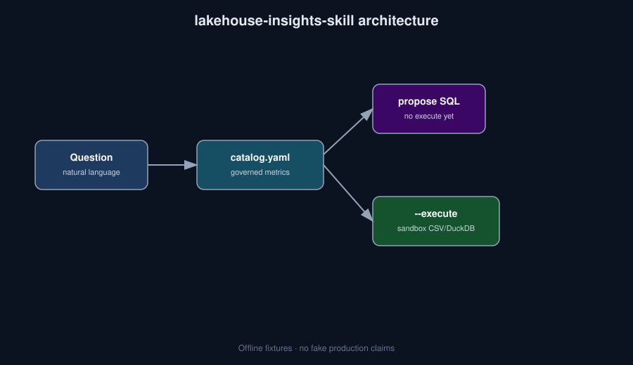

# lakehouse-insights-skill


**Governed metrics catalog → proposed SQL for analytics questions. Execute only with an explicit `--execute` flag.**

> Who it's for: Data platform SAs who want agents constrained by a metrics catalog.

## Why this exists

Text-to-SQL without a metric contract invents columns. This skill loads `metrics/catalog.yaml` (JSON twin for zero-deps), proposes SQL, and never runs anything unless you pass `--execute` against a sandbox CSV/DuckDB.

## Install

```bash
python -m venv .venv && source .venv/bin/activate
pip install -e .
# optional DuckDB sandbox:
pip install -e ".[duckdb]"
```

Or with pipx (once published to PyPI): `pipx install lakehouse-insights-skill` — until then use editable install from this repo.

## 30-second demo

```bash
python -m lakehouse_insights --help
python -m lakehouse_insights "revenue by region"
python -m lakehouse_insights "which pipelines failed" --execute
```

Or simply:

```bash
make demo
```

## What it is NOT

- Not a hosted text-to-SQL LLM service
- Not connected to production Databricks / Snowflake by default
- Not an auto-execute agent (execute is opt-in)

## Architecture



## Roadmap

- [ ] Databricks SQL warehouse adapter (read-only)
- [ ] Richer metric lineage metadata
- [ ] Skill packaging for more agent hosts

## Contributing

See [CONTRIBUTING.md](./CONTRIBUTING.md). Be kind — [CODE_OF_CONDUCT.md](./CODE_OF_CONDUCT.md). Security reports: [SECURITY.md](./SECURITY.md).

## License

MIT
